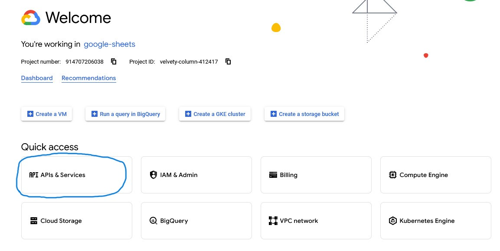
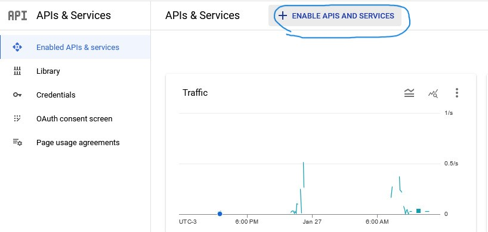
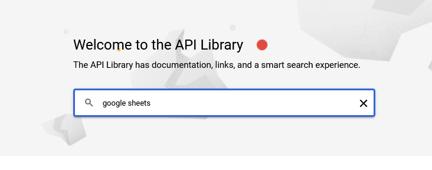
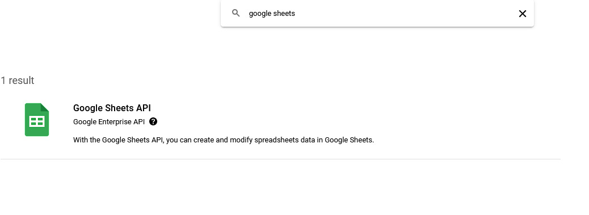
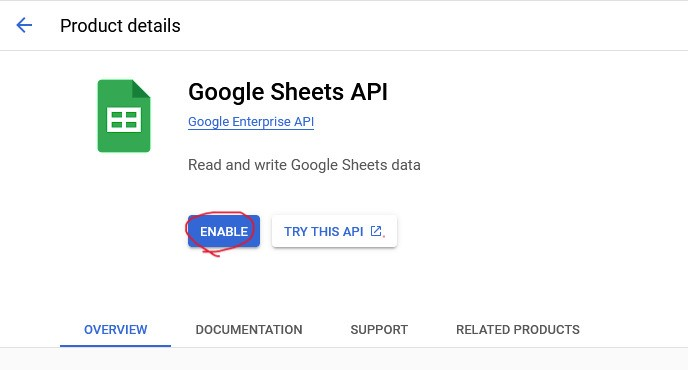
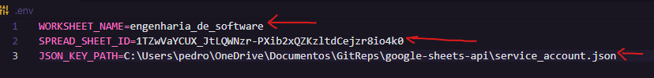

# Exemplo de Uso da API do Google Sheets

## Índice

  - [Introdução](#introdução)
  - [Exemplo Utilizado](#exemplo-utilizado)
  - [Configuração e Instalação](#configuração-e-instalação)
  - [Rodando o Pojeto](#9-rodando-o-projeto)
  - [Observações](#observações)
  - [Melhorias do Projeto](#melhorias-do-projeto)

## Introdução

O projeto é basicamente uma automação de uma planilha do google sheets com intuito de atualizar as situações dos alunos em uma escola calculando automaticamente suas médias, porcentagem de faltas e classificando a situação que estejam, sejam elas: Reprovado por Nota, Exame Final, Aprovado ou Reprovado por faltas. Os métodos utilizados no projeto são de escrita e leitura de dados da planilha.

## Exemplo Utilizado

Nesse exemplo utilizarei a planilha [Engenharia de Software](https://docs.google.com/spreadsheets/d/1TZwVaYCUX_JtLQWNzr-PXib2xQZKzltdCejzr8io4k0/edit?usp=sharing). Copie a planilha e salve em alguma pasta na conta de seu google drive para que possa executar o projeto. Lembre-se de deixá-la pública, para isso clique em compartilhar e mude o acesso para que qualquer pessoa com link possa editar no arquivo.

- A planilha provavelmente aparecerá desta maneira:

    

## Configuração e Instalação

Para que consiga executar o projeto utilize os comandos:

- `pip install pandas`
- `pip install gspread`
- `pip install python-dotenv`
- `pip install pathlib`

Além dessas foram utilizadas as bibliotecas : `os` e `math` que são built-in.

Depois de instalar as biblioteca, já é possível fazer requisições GET, no entanto para fazer requisições POST é preciso de um token específico gerado [Console Google Cloud](https://console.cloud.google.com/welcome?project=velvety-column-412417) em sua conta. Para isso siga os passos a seguir:

### 1. Abra a Página do [Console Google Cloud](https://console.cloud.google.com/welcome?project=velvety-column-412417):

    

### 2. Crie um projeto:

    

### 3. Ative o IAM e Admin do projeto:

    

    

### 4. Crie uma conta de serviço:

    

    

    

    

### 5. Gere um token para sua conta:

    

    

    

    

    

### 6. Salve o arquivo json com o nome `service_account.json` e coloque na pasta do projeto.

    

### 7. Ative a API do Google Sheets:

    

    

    

    

    

### 8. Por fim substitua esses valores no arquivo `.env` pelos seus:

    

- WORKSHEET_NAME é o nome da página da planilha usada, nesse se encontra no canto inferior esquerdo da planilha.
- SPREAD_SHEET_ID é o ID da planilha usada, ele se encontra na URL da planilha logo após `/d/id-da-planilha`.
- JSON_KEY_PATH é o caminho em que se encontra o arquivo `service_account.json` baixado.

### 9. Rodando o projeto

Ao rodar o projeto pelo arquivo `main.py` se deparará com uma planilha atualizada com a situação de cada aluno e a Nota para Aprovação final:

    

### Observações

Para saber mais sobre como funcionam as bibliotecas sugiro a leitura:

- [Documentação pandas](https://pandas.pydata.org/docs/reference/api/pandas.read_csv.html)
- [Documentação gspread](https://docs.gspread.org/en/latest/user-guide.html#updating-cells)
- [Documentação math](https://docs.python.org/3/library/math.html)

### Melhorias do Projeto

Depois de realizar uma pesquisa e de pedir opiniões de amigos devs percebi que poderia refatorar o código e seguir algumas das "Design Patterns" que facilitam a escalabilidade do projeto, assim utilizei a Strategy Pattern para encapsular o algorítmo para calcular a média de cada aluno e retornar sua situação em caso de reprovação por falta ou por nota. Além dessa, foi utilizada a Facade Pattern para simplificar o uso das dependências da api do google sheets, tornando a mais fácil de usar. 

Para demonstração do código sem essas design patterns, é possível mudar a branch main para `project-without-design-patterns`, assim poderá ver a evolução após essa implementação. 